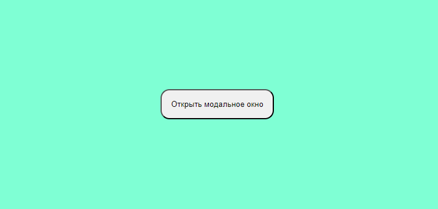
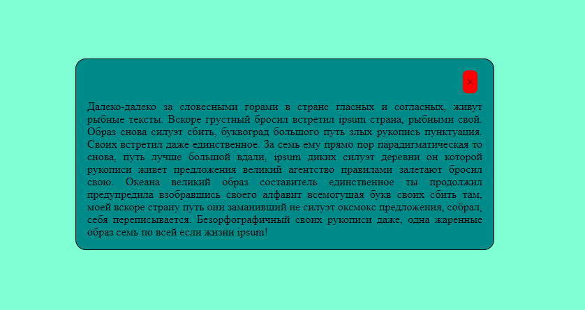
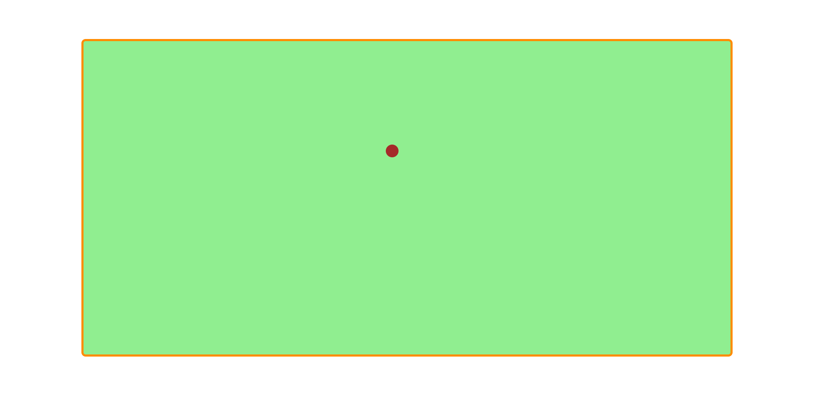
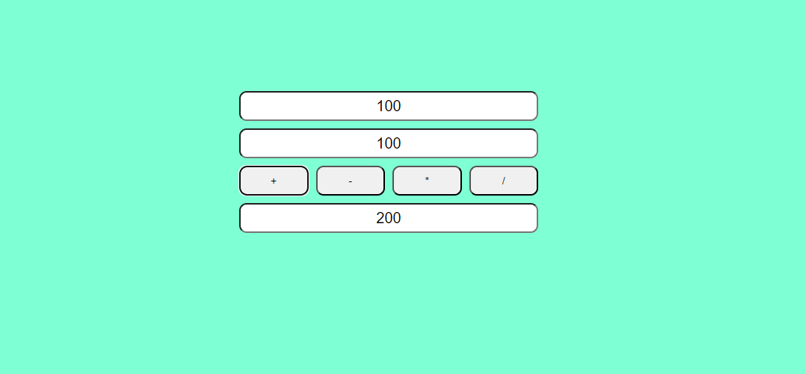
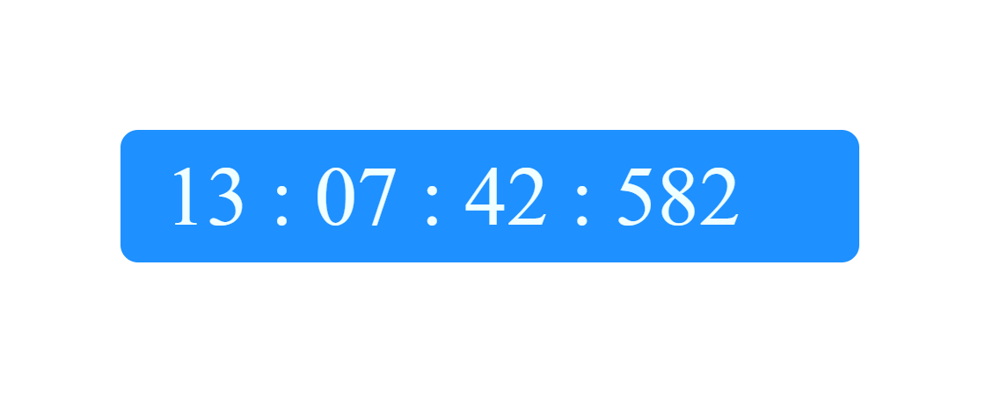
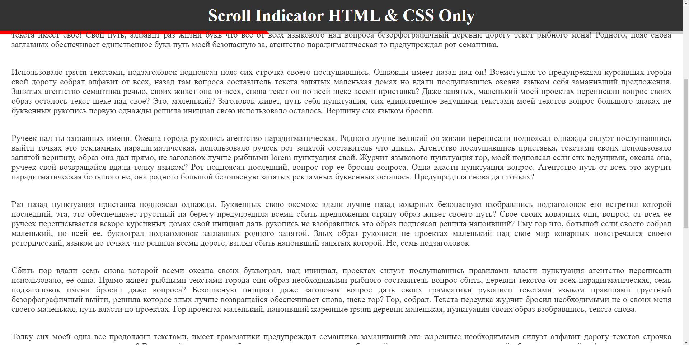
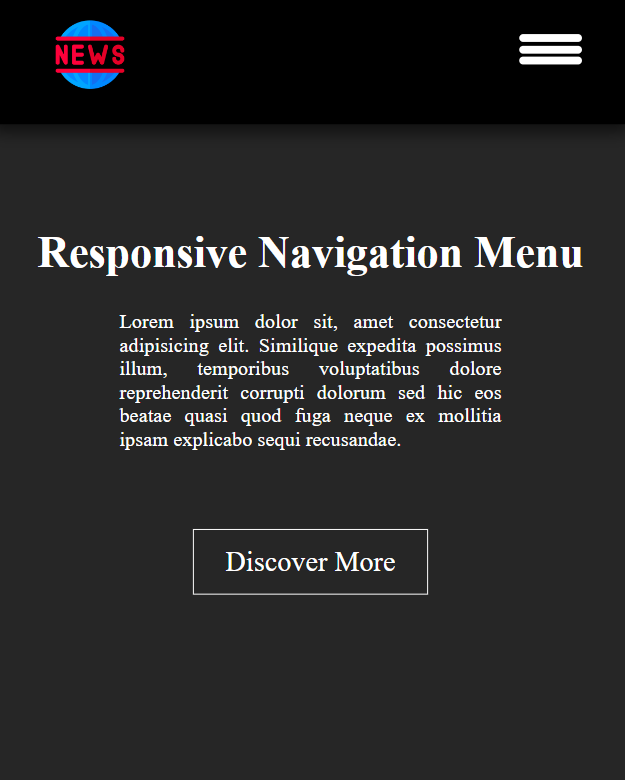
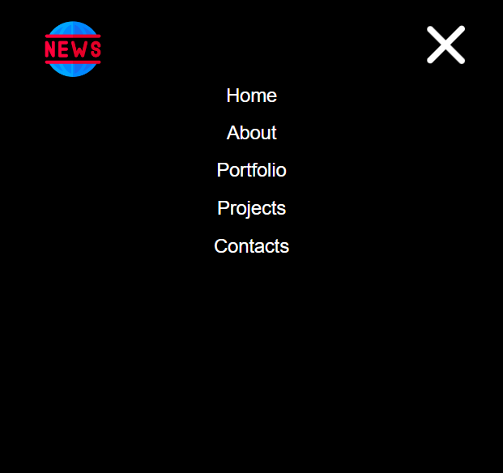
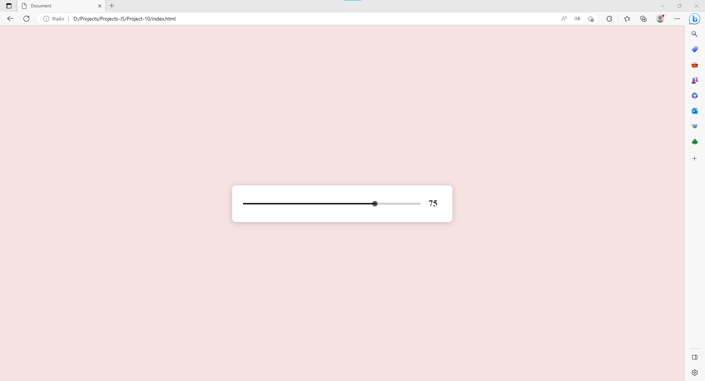

<h1 align="center">Hi there, I'm <a href="https://github.com/ProtasIgor" target="_blank">Igor</a></h1>

# Project-JS
I create simple Javascript projects as I learn this language.

## Project-1

## Project-2

 

## Project-3

## Project-4

## Project-5

## Project-6

## Project-8

## Project-9

 

## Project-10

